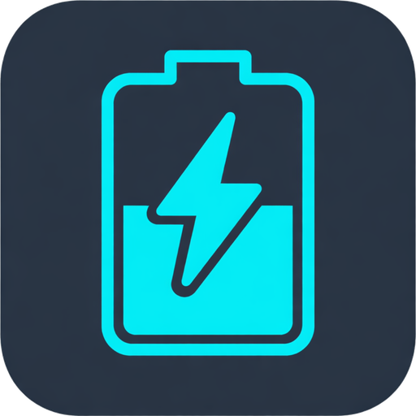

# MarsTip

<p align="center">
  
</p>

<p align="center">
  <strong>Desktop monitoring app for Marstek batteries (Venus C/D/E)</strong>
</p>

<p align="center">
  <a href="#english">English</a> •
  <a href="#français">Français</a> •
  <a href="#download">Download</a>
</p>

---

## English

### About

MarsTip is a cross-platform desktop application for monitoring Marstek home batteries (Venus C, Venus D, Venus E series). It communicates directly with your battery over your local network via UDP, with no cloud dependency.

### Features

- **Auto-discovery** - Automatically detects Marstek batteries on your local network
- **Real-time monitoring** - Battery status, charge level, power flow, temperature
- **Energy statistics** - Solar production, grid import/export, total consumption
- **Multi-battery support** - Select and switch between multiple batteries
- **Adaptive polling** - Automatically adjusts refresh rate based on response time
- **Offline** - Works entirely on your local network, no internet required

### Requirements

- Marstek Venus C, D, or E battery
- Battery connected to your local network (WiFi or Ethernet)
- Local API enabled via the official Marstek app
- Computer on the same network as the battery

### Tech Stack

- **Frontend**: SvelteKit + Svelte 5 + TailwindCSS v4
- **Backend**: Rust + Tauri 2.0
- **Protocol**: JSON-RPC over UDP (port 30000)

---

## Français

### À propos

MarsTip est une application desktop multi-plateforme pour surveiller les batteries domestiques Marstek (séries Venus C, Venus D, Venus E). Elle communique directement avec votre batterie via votre réseau local en UDP, sans dépendance au cloud.

### Fonctionnalités

- **Auto-détection** - Détecte automatiquement les batteries Marstek sur votre réseau local
- **Monitoring temps réel** - État de la batterie, niveau de charge, flux d'énergie, température
- **Statistiques énergie** - Production solaire, import/export réseau, consommation totale
- **Multi-batteries** - Sélectionnez et basculez entre plusieurs batteries
- **Polling adaptatif** - Ajuste automatiquement le taux de rafraîchissement selon le temps de réponse
- **Hors-ligne** - Fonctionne entièrement sur votre réseau local, pas d'internet requis

### Prérequis

- Batterie Marstek Venus C, D ou E
- Batterie connectée à votre réseau local (WiFi ou Ethernet)
- API locale activée via l'application officielle Marstek
- Ordinateur sur le même réseau que la batterie

### Stack technique

- **Frontend**: SvelteKit + Svelte 5 + TailwindCSS v4
- **Backend**: Rust + Tauri 2.0
- **Protocole**: JSON-RPC sur UDP (port 30000)

---

## Download

### Latest Release

| Platform | Download |
|----------|----------|
| **macOS Apple Silicon** (M1/M2/M3) | [MarsTip_x.x.x_aarch64.dmg](https://github.com/jsys/marstip/releases/latest) |
| **macOS Intel** | [MarsTip_x.x.x_x64.dmg](https://github.com/jsys/marstip/releases/latest) |
| **Windows** | [MarsTip_x.x.x_x64-setup.exe](https://github.com/jsys/marstip/releases/latest) |
| **Linux (Debian/Ubuntu)** | [marstip_x.x.x_amd64.deb](https://github.com/jsys/marstip/releases/latest) |
| **Linux (AppImage)** | [marstip_x.x.x_amd64.AppImage](https://github.com/jsys/marstip/releases/latest) |

> All releases are available on the [Releases page](https://github.com/jsys/marstip/releases).

### Build from source

```bash
# Clone the repository
git clone https://github.com/jsys/marstip.git
cd marstip/app

# Install dependencies
npm install

# Run in development mode
npm run tauri dev

# Build for production
npm run tauri build
```

---

## License

This project is licensed under the **GNU General Public License v3.0** - see the [LICENSE](LICENSE) file for details.

---

## Disclaimer

This project is not affiliated with, endorsed by, or connected to Marstek in any way. Marstek is a trademark of its respective owner. Use at your own risk.
